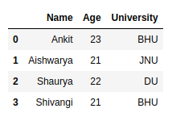

# Pandas 从Python dict中加载数据
1. 使用 pandas.Dataframe 类的默认构造函数从 Dictionary 创建 DataFrame
	``` python
	# import pandas library
	import pandas as pd
	
	# dictionary with list object in values
	details = {
		'Name' : ['Ankit', 'Aishwarya', 'Shaurya', 'Shivangi'],
		'Age' : [23, 21, 22, 21],
		'University' : ['BHU', 'JNU', 'DU', 'BHU'],
	}
	
	# creating a Dataframe object
	df = pd.DataFrame(details)
	
	df
	```
	Output:

	
	
2. 使用用户定义的索引从 Dictionary 创建 DataFrame。
	``` python
	# import pandas library
	import pandas as pd
	
	# dictionary with list object in values
	details = {
		'Name' : ['Ankit', 'Aishwarya', 'Shaurya', 'Shivangi'],
		'Age' : [23, 21, 22, 21],
		'University' : ['BHU', 'JNU', 'DU', 'BHU'],
	}
	
	# creating a Dataframe object from dictionary
	# with custom indexing
	df = pd.DataFrame(details, index = ['a', 'b', 'c', 'd'])
	
	df	
	```
	Output:
	

3. 从简单字典创建 DataFrame，即具有键和简单值（如整数或字符串值）的字典。
	``` python
	# import pandas library
	import pandas as pd
	
	# dictionary
	details = {
		'Ankit' : 22,
		'Golu' : 21,
		'hacker' : 23
		}
	
	# creating a Dataframe object from a list
	# of tuples of key, value pair
	df = pd.DataFrame(list(details.items()))
	
	df
	
	```
	Output:
	

4. 从 Dictionary 创建 DataFrame 仅包含所需的列。
	``` python
	# import pandas library
	import pandas as pd
	
	# dictionary with list object in values
	details = {
		'Name' : ['Ankit', 'Aishwarya', 'Shaurya', 'Shivangi'],
		'Age' : [23, 21, 22, 21],
		'University' : ['BHU', 'JNU', 'DU', 'BHU'],
	}
	
	# creating a Dataframe object with skipping
	# one column i.e skipping age column.
	df = pd.DataFrame(details, columns = ['Name', 'University'])
	
	df
	
	```
	Output:
	

5. 从具有不同方向的字典创建数据帧，即字典键充当数据帧中的索引。
	``` python 
	# import pandas library
	import pandas as pd
	
	# dictionary with list object in values
	details = {
		'Name' : ['Ankit', 'Aishwarya', 'Shaurya', 'Shivangi'],
		'Age' : [23, 21, 22, 21],
		'University' : ['BHU', 'JNU', 'DU', 'BHU'],
	}
	
	# creating a Dataframe object in which dictionary
	# key is act as index value and column value is
	# 0, 1, 2...
	df = pd.DataFrame.from_dict(details, orient = 'index')
	
	df
	
	```
	Output:
	
6. 从嵌套字典创建 DataFrame。
	``` python
	# import pandas library
	import pandas as pd
	
	# dictionary with dictionary object
	# in values i.e. nested dictionary
	details = {
		0 : {
			'Name' : 'Ankit',
			'Age' : 22,
			'University' : 'BHU'
			},
		1 : {
			'Name' : 'Aishwarya',
			'Age' : 21,
			'University' : 'JNU'
			},
		2 : {
			'Name' : 'Shaurya',
			'Age' : 23,
			'University' : 'DU'
			}
	}
	
	# creating a Dataframe object
	# from nested dictionary
	# in which inside dictionary
	# key is act as index value
	# and column value is 0, 1, 2...
	df = pd.DataFrame(details)
	
	# swap the columns with indexes
	df = df.transpose()
	
	df
	
	```
	Output:
	

------------
参考文献：[How to create DataFrame from dictionary in Python-Pandas?](https://www.geeksforgeeks.org/how-to-create-dataframe-from-dictionary-in-python-pandas/)