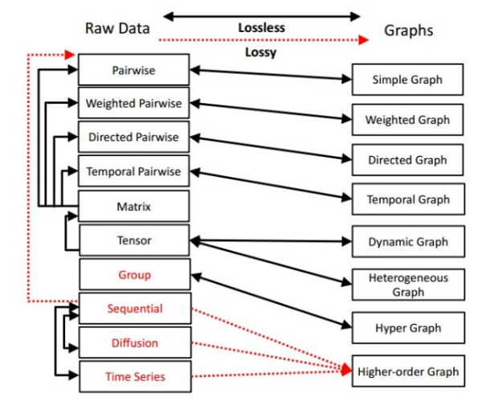
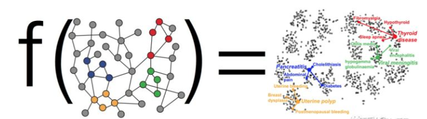
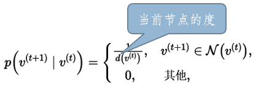
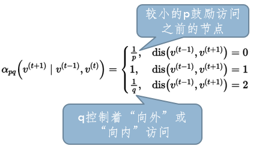

## 图表征学习（图嵌入）

### 问题背景

**为什么将数据表示为图的格式？**这主要由两方面的原因，第一点是图提供了数据的通用表示形式，如下图所示，大量的数据结构都可以归纳为图结构数据。图中黑色箭头表示可以无损的转换，红色箭头表示转换会有损失，张量和矩阵类型的数据可以无损地转换成图的邻接矩阵的形式，也可以转换成Pairwise类型的数据从而转换成对应类型的图。Group类型的数据可以转换成超图的形式，一些序列类型的数据可以转换成高阶网络的形式。

第二方面就是大量的现实问题都可以归纳为图上的任务，比如：异常检测，识别疾病基因可以归纳为节点分类任务。朋友推荐，商品推荐，药物副作用预测可以归纳为链接预测任务；蛋白质性状分类，分子分类可以归纳为图分类任务；舆情分析，社交网络影响力评估可以归纳为社区发现任务等等。

**为什么需要对图侥幸表征学学习呢？**首先，图的结构信息复杂，节点和边包含丰富的额外信息，如果独立地考虑这些节点，会损失大量的关联信息。其次，在图上直接进行机器学习具有一定的局限性，图是由节点和边构成，这些关系一般只能使用数学，统计或者特定的子集进行表示，但是嵌入之后的向量空间具有更加灵活和丰富的计算方式。第三，图嵌入能够压缩数据， 我们一般用邻接矩阵描述图中节点之间的连接。 将邻接矩阵用来表示大型图几乎是不可能的。但是嵌入可以看做是一种压缩技术，能够起到降维的作用。最后，向量计算比直接在图上操作更加的简单、快捷。

**图表征学习和图神经网络的区别与联系：**

### 问题定义

简单来说，图表征学习（图嵌入）任务就是希望能够在图上学习到一个模型，该模型的输入是一个图，输出是节点或边或图的表征向量。如下图所示：

更加的严谨一点的定义是：我们期望将图中的节点或边映射到一个低维的向量空间中，使得获得的表示向量可以尽可能地保留网络的拓扑结构及节点特征，并用其作为节点的表示。
那么，这就涉及到一下两个问题：我们应该保留哪些节点信息？以及，怎么保留节点信息？对于前者，许多工作从不同的角度考虑保留何种节点信息，比如通过随机游走等方法保留节点共现的Deepwalk，Node2vec，根据节点在图中的角色保留结构角色的Struct2vec，此外还有保留节点状态，保留社区结构等保留节点信息的方法等等。
针对后者，如何保留节点的信息，可以通过矩阵分解，词嵌入，以及神经网络等方法来保留节点的信息，学习用于节点表征学的模型

### 经典图表征学习方法

#### Random Walk 随机游走方法

基于随机游走的方法的核心思想是现将图转换成序列，然后对序列应用一些词表征学习的方法，获得节点的表征，对于图到序列的过程，目前最常用的方法是随机游走（random walk），不同的游走方法可以得到不同的序列。
对于序列到节点表征的过程，我们可以根据序列中节点的共现关系，可以应用NLP领域中的一些词嵌入的方法，得到节点的表征。

序列的生成受到随机游走的策略的绝对影响，根据不同的游走策略，序列会有不同的偏好，而最后的表征结果中也会体现出这种偏好。如下图所示，根据DFS和BFS两种策略在图上进行随机游走得到的序列是市完全不同的，这种不同会反映在最后的表征学习结果中。

针对不同的游走策略，有不同的图表征方法被提出：
Deepwalk：

Node2Vec: 

针对异构图的问题，Metapath2Vec的方法在异构图上定义了元路径，并定义了异构图上的元路径的随机游走方法。

#### SDNE等深度学习方法

SDNE没有采用随机游走的方法而是使用自动编码器来同时优化一阶和二阶相似度，学习得到的向量表示保留局部和全局结构，并且对稀疏网络具有鲁棒性。
一阶相似度表征了边连接的成对节点之间的局部相似性。 如果网络中的两个节点相连，则认为它们是相似的。 举个例子：当一篇论文引用另一篇论文时，意味着它们很可能涉及相似的主题，如6和7。但是当两个节点不相连时如5和6，他们就不具有相似度了吗？显然不是，从下图可以看出来他们虽然没有直接连接，但是他们有共同的邻居1,2,3,4,那么这时候就需要用二街相似度来衡量了。

在这里作者使用一阶相似度衡量在嵌入域中两个节点的相似度，使用二阶相似度衡量自动编码器输出的“虚拟节点”与输入节点的邻居的相似度。
SDNE的模型框架如下图所示：

其主要思想是：其一，如果两个节点i和jj很相似，那么i和j在降维后目标子空间中也应该尽量接近（一阶相似度），其对应着图中的一阶损失函数$L_{1st}$；其二，解码器的输出应该和输入尽可能相似（二阶相似度），解码器的输出是与输入维度相同的向量，也就可以将其理解为输出了一个“虚拟的节点”，要让输入节点的邻居和输出的虚拟节点的邻居尽可能的相似（二阶相似度），其对应着图中的二阶损失函数：$L_{2nd}$。

